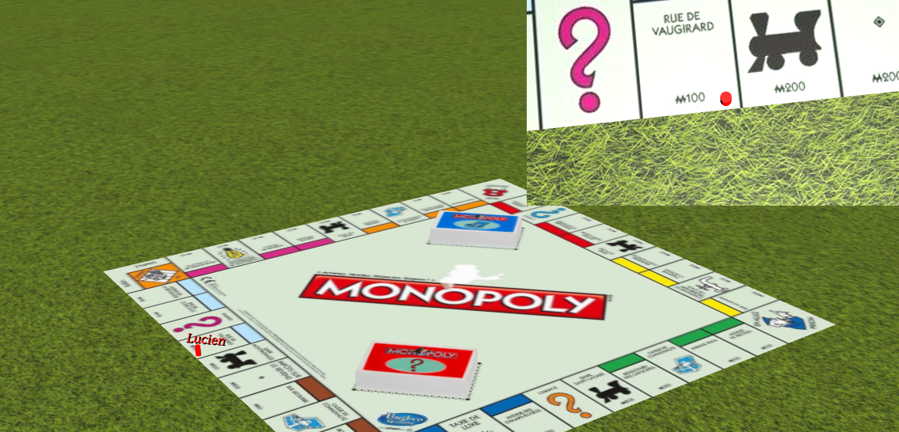
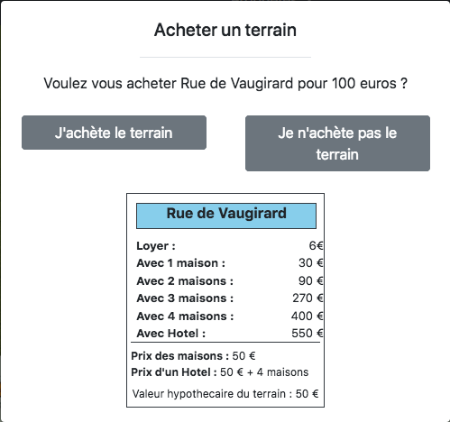
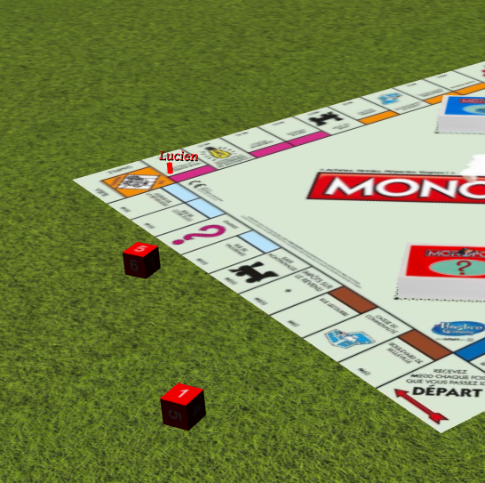

# Monopoly

<p align="center">
  
</p>

  

## External features

This project uses the Github repo [threejs-dice](https://github.com/byWulf/threejs-dice) from byWulf, which allows us to throw predetermined dices in the game.

## Project's Architecture
```
Monopoly  
|  webbapp.py : server controler for the web application
└──templates : jinja2 templates for the web application
└──game : python module with the game algorithm
└──tests : unittests for the game module
└──static : static files download by the user while loaing the page
    └──css
    └──js
        |  sockets.js : file managing all the socket communication beetwen server and clients
        └──graphics : js module with all the graphic interface
```

## How to test it

The master branch is deployed on heroku at [this link](https://monolopy.herokuapp.com). It is not persistent yet, so you will need to avoid refreshing the page. You just need to create a game, share the id with the other players, and all click the ready button.
Once this is done, the game will run between different pages. The trading system is not implemented yet, and the game lacks a bit of information (notifications), but it is coming soon.

## How to test

### Game unittests

In the root folder :
```
export PYTHONPATH=.
python -m unittest discover -s tests -t tests
```
The tests are automatically ran by the CircleCI on the project, which allows to deploy the new version if the test passed.

## Game

### Types of boxes

`start`, `street`, `station`, `public-service`, `community-fund`, `chance`, `tax`, `jail`, `park`, `to-jail`
